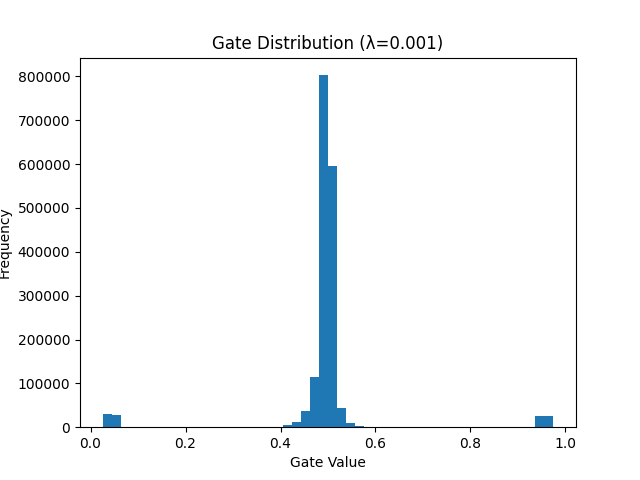

# Self-Pruning Neural Network (CIFAR-10)

This project implements a **self-pruning neural network** that learns to remove unnecessary weights *during training itself*, instead of applying pruning after training.


##  Key Idea

Each weight is paired with a learnable **gate**:

```
gate = sigmoid(gate_score)
output = weight × gate
```

* If gate → 0 → weight is effectively removed
* If gate → 1 → weight is retained

The model automatically learns which connections are important.

---

## Loss Function

```
Total Loss = CrossEntropyLoss + λ × SparsityLoss
```

* **CrossEntropyLoss** → improves classification accuracy
* **SparsityLoss** → encourages pruning
* **λ (lambda)** → controls the trade-off between accuracy and sparsity

---

##  Architecture

```
Input (32×32×3)
↓
Flatten (3072)
↓
PrunableLinear (3072 → 512) + ReLU
↓
PrunableLinear (512 → 256) + ReLU
↓
PrunableLinear (256 → 128) + ReLU
↓
PrunableLinear (128 → 10)
↓
Output (10 classes)
```

---

##  Results

| Lambda | Accuracy (%) | Sparsity (%) |
| ------ | ------------ | ------------ |
| 1e-5   | 46.89%       | 0.02%        |
| 1e-4   | 47.74%       | 0.17%        |
| 1e-3   | 48.26%       | 3.33%        |

###  Observations

* Increasing λ increases sparsity
* Accuracy remains stable → pruning is conservative
* The model removes only less important weights

---

##  Gate Distribution



* Most gates remain active
* Some move toward zero → weak connections suppressed

---

##  How to Run

### ▶ Google Colab (Recommended)

1. Open Colab
2. Enable GPU (Runtime → Change runtime → T4 GPU)
3. Upload `self_pruning_network.py`
4. Run:

```
!python self_pruning_network.py
```

---

## Output Files

* `results_table.csv` → Accuracy & sparsity values
* `gate_distribution.png` → Histogram of gate values

---

##  Key Learnings

* Neural networks can **learn pruning during training**
* L1-based regularization helps suppress weak connections
* Loss balancing is important for effective pruning
* There is a trade-off between **accuracy and sparsity**

---

##  Conclusion

This project demonstrates that **model compression can be integrated directly into training**.
Even with moderate sparsity, the model maintains performance, showing that many weights are redundant.

---

##  Author

**Thrinasoni R**
B.Tech Computer Science Engineering

---

